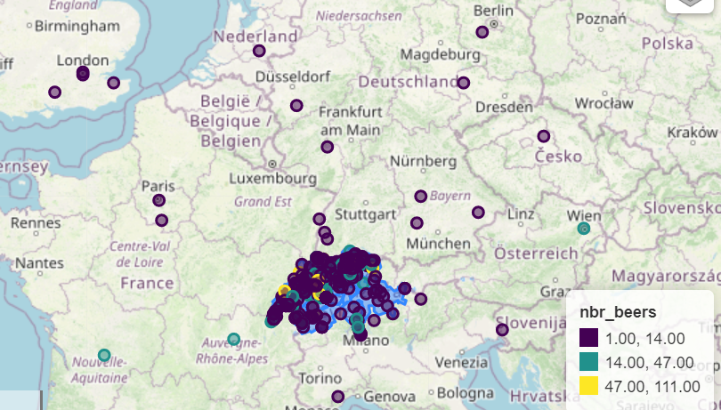
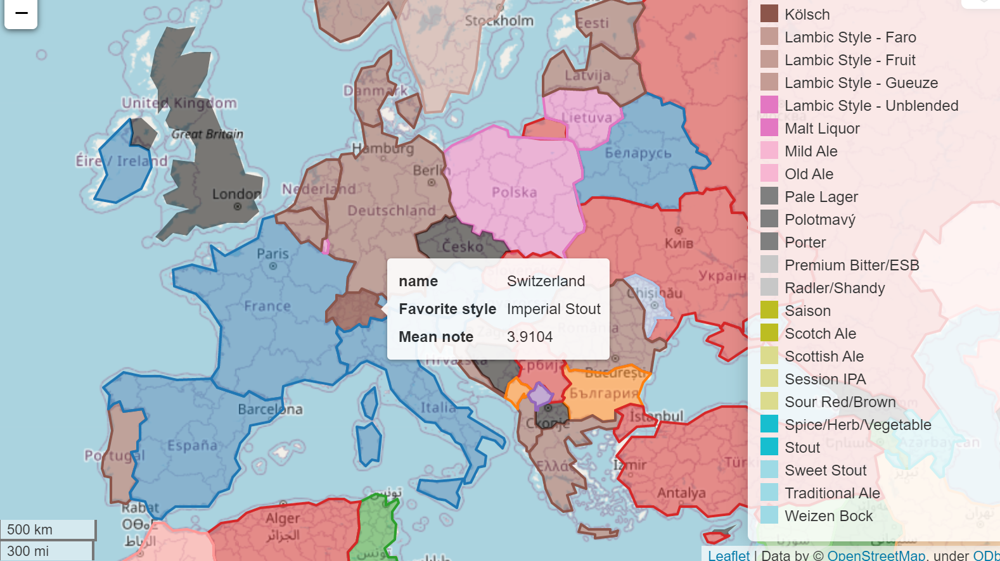

# Global to local trends in favorite beer styles: a spatial and temporal analysis linking production and consumption

## Abstract

Beer is one of the most popular beverages and is consumed worldwide. With this in mind, we are interested to analyze and depict the type of beer consumption across the world,
that is, which kind of beers are consumed and preferred in which country. Being provided with the dataset of the beer reviews website Ratebeer, we have access to a huge amount of data about beer ratings from users from everywhere in the world. The goal of the project is to create some interactive spatiotemporal map showing the trends of production and consumption of each country, starting from the earliest reviews available until 2017. It will help us to determine the preference and trend in beer consumption for the analyzed period of time, and we will try to explain the reasons behind it. Google maps API will be used to localize more precisely the breweries in their respective countries.

## Research questions

1) Which are the most popular beer styles produced and consumed by each country over time? 

2) Are there some trends that can be observed depending on time periods and/or countries? Are these global trends the same as more local trends (inside a country)?

3) Why are these beer styles more popular? What are the features that make them more popular?

## Proposed additional datasets

- Google Maps API will give us additional information about breweries locations: latitude and longitude. 
- Geopandas
- Maps delimitation of Switzerland or other required country by district.
- Brewer’s Friend Beer recipe dataframe, which gives us the different properties of each style of beer to perform a clustering of beerstyles into wider categories: https://www.kaggle.com/datasets/jtrofe/beer-recipes?resource=download

## Methods

### Google API

Using google API, we can retrieve the location of the breweries. We already used a simple query to find all of the breweries locations and some mistakes were found. So we still need to find an optimized google API query to minimize the errors while retrieving most of the locations. We will use different queries and try to find which of the queries yield the best results. One idea would be to aggregate the different queries and compare them to find errors and discard the outliers.

  
  

### Beers clustering into categories

We want to separate our beerstyles into wider categories, to have more distinguishable trends and to get sharper maps. Brewer’s Friend Beer recipe dataframe will help us to divide the beerstyle into different clusters by providing information about the properties specific to each style of beer.

### Global scale analysis

By using Google maps API giving us the latitude and longitude of the breweries, we will be able to produce different visualization maps with the Geopandas library. The maps that interest us are the following, viewed on a world map:

Plot a map with breweries density.
Clustering breweries based on their main produced beer style, preferred beer styles
Style liking evolution per country with evolution over time. Proposed time interval of either 6 months or one year, to be determined exactly.
Brewery ranking based on users ratings, changing over time

We categorized beer styles into categories that take various beerstyle into account, as having too many different beer styles is too difficult to handle for specified maps or analysis.

### Local scale analysis

maps based on smaller scale regions, such as Switzerland, to perform a more detailed analysis. 
Comparison between two different territories, such as USA and Europa, which probably have different beer consumption habits.

## Analysis part

The main objective now would be to explain the observed consumption trends. Why are these styles of beer more appreciated globally? We will try to find explanations by performing some algorithms, such as linear regression, to identify the features between palate, taste, aroma, abv or appearance that make a beer more appreciated.

We will also make a comparison between the production and appreciation of a style of beer in a given country. Import vs local production: which receive the best ratings? What came first, the local craft or the import one ?

Here is an example of an interactive map for the favorite beer style per country until 2017

  

## Proposed timeline

For the beginning of milestone III (02.12.22):

Having the final data of google API, with the least amount of errors
Clustering the beers into categories
Correcting and adjusting country dataframe

For the 09.12.22:

Final check for data integrity
Creating most of the maps
Understand how to create the website for the story

For the 16.12.22: 

Having all the maps finished
Having a good grasp with the analysis part, having performed a linear regression and identified the main features impacting the popularity of the beer. 

For the 23.12.22: 
Finishing the last analysis and the story

## Organization within the team

Noé: Google API, mapping with the retrieved data, analysis part
Bastien: Mapping beer style and countries, analysis part
Nicolas: analysis part
Baptiste: Google API, beer clustering, analysis part

## Questions for TAs
 
We noted that the API returned quite a few mistakes, as it localized breweries far away from their originate location. The % of error seems to be non negligible. Is there a way to resolve this issue? Otherwise we will probably have to discard the incorrect placement, which would results in a lot of data lost.

)
