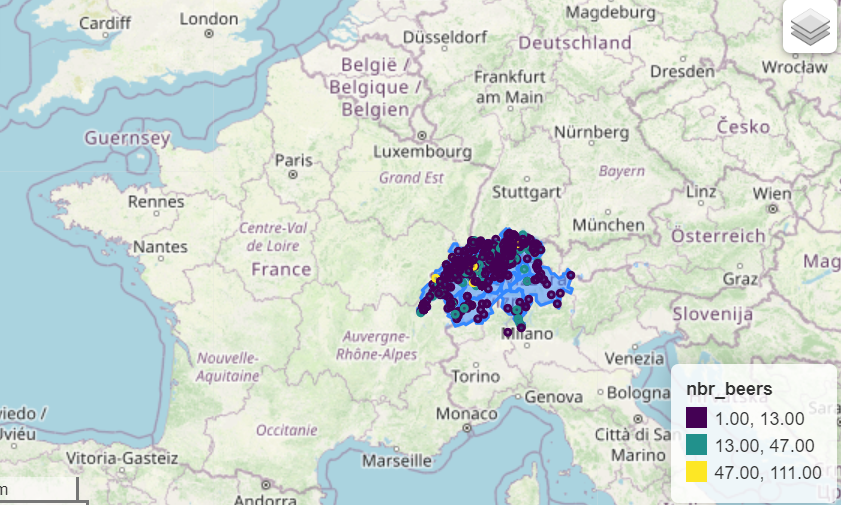

# Brewery locations - Where should you install your brewery based on beer reviews ?

Github files:

--> to update
- project_beer_reviews.ipynb: main notebook for the project
- GoogleAPI.ipynb: notebook containing the google API requests to get breweries latitudes and longitudes

Datastory website:
- [Sustainable Pandas Website](https://nicolasrochat.github.io)

## Abstract

This projects aims to give advice to new brewers and indicate if they should install themselves in a crowded city or in the calm countryside. A look will also be given into beer styles and what are differences can be found between beer crafted in urban area and in rural area.

## Research questions

- Are there major differences between urban and rural breweries? 
- Do breweries in big cities perform better in general? Is it the same for small breweries ? 
- Are there specific features related to urban or rural breweries?

## Proposed additional datasets

--> to update
- Google Maps API will give us additional information about breweries locations: latitude and longitude
- Geopandas, which will provide spatial data for the maps production.
- Maps delimitation of Switzerland or other required country by district.
- [Brewer’s Friend Beer recipe](https://www.kaggle.com/datasets/jtrofe/beer-recipes?resource=download) dataframe, which holds the different properties of each style of beer to perform a clustering of beerstyles into wider categories.

## Methods

### Google API

Using google API, we can retrieve the location of the breweries. We already used a simple query to find all of the breweries locations and some mistakes were found. So we still need to find an optimized google API query to minimize the errors while retrieving most of the locations. We will use different queries and try to find which of the queries yield the best results. One idea would be to aggregate the different queries and compare them to find errors and discard the outliers, with a clustering algorithm for example. Eventually, we will show the perfomance of the queries on a ROC curve. We plotted our first API requests below: the second image shows a better query request for retrieving brewery locations in Switzerland than the one on the left.

  
  

### Beers clustering into categories

We want to separate our beerstyles into wider categories, to get more distinguishable trends and sharper maps . Brewer’s Friend Beer recipe dataframe will help us to divide the beerstyle into different clusters by providing information about the properties specific to each style of beer.

### Global scale analysis

Google maps API will provide the latitude and longitude of the breweries, with which we will be able to produce different visualization maps with the Geopandas library. The maps that interest us are the following, viewed on a world map:

- Plot a map with breweries density
- Clustering breweries based on their main produced beer style, preferred beer styles
- Style liking evolution per country with evolution over time. Proposed time interval of either 6 months or one year, to be determined exactly
- Map showing the best breweries based on the user rating, changing over time

Here is an example of an interactive map for the favorite beer style per country in Europa until 2017

  

### Local scale analysis

Then, maps based on smaller scale regions, such as Switzerland, will be produced to perform more detailed analysis. 
Comparison between two different territories, such as USA and Europa, which probably have different beer consumption habits, can also be processed.

### Features and trends analysis 

The main objective now would be to explain the observed consumption trends. Why are these styles of beer more appreciated globally? We will try to find explanations by performing some algorithms, such as linear regression, to identify the features between palate, taste, aroma, abv or appearance that make a beer more appreciated. Some results of the global and local trends will also be further investigated with graphics.

We will also make a comparison between the production and appreciation of a style of beer in a given country. Importation vs local production: which one receives the best ratings? 

## Organization within the team

--> to update
- Noé: Google API, mapping with the retrieved data, analysis part
- Bastien: Mapping beer style and countries, analysis part
- Nicolas: Analysis part + website
- Baptiste: Google API, beer clustering, analysis part
